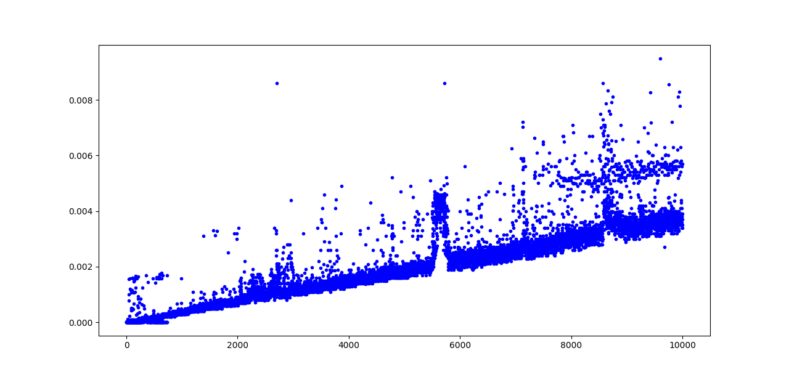

# ef23-sorting

## Usage

To analyze a predefined sorting algorithm, just run the python file in the algorithms folder.

To analyze a custom sorting algorithm, import `SortingAlgorithm` from the `utils` module and run the following code:

```py
from utils import SortingAlgorithm

def mycustomsort(array):
    # Your code here
    return array

if __name__ == "__main__":
    s = SortingAlgorithm(mycustomsort)

    s.test(20) # Test the algorithm with a random list of length 20
    s.analyze() # Create a plot and analyze the behaviour of the algorithm for different lengths
```

## Algorithms

In the algorithms folder, there is currently one algorithm:

### Bucketsort



Note: All buckets are +- size 10 and for sorting the buckets themselves, the internal `sorted` function was used.
